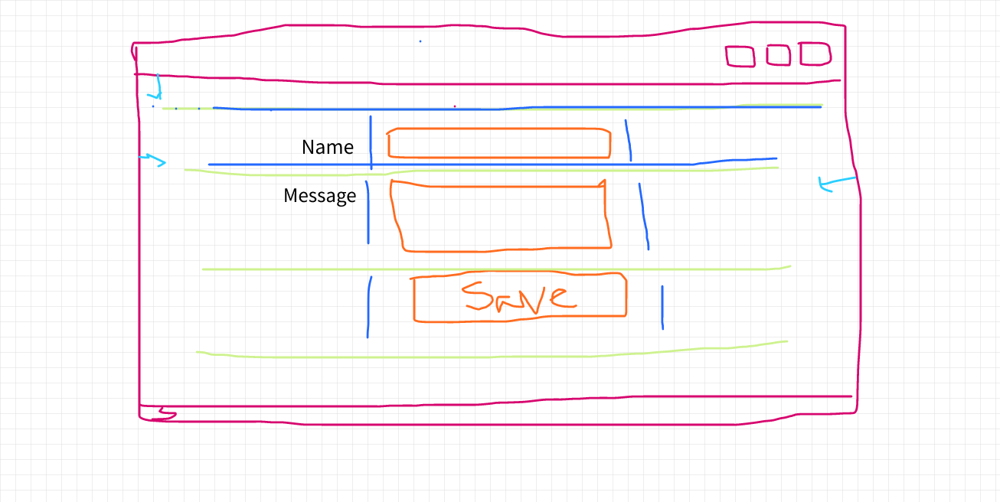
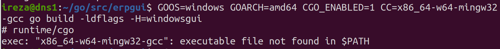

# minierp
Project based learning, application development from scratch using golang.


* [Project Outline](./project_outline.md)
* [Requirement specification](./assignment/02_Database_structure/Rezaul.md)
* [Fyne Environment installation process](./prepare_fyne_environment.md)



## How do we compile for different platform?
> GOOS=windows GOARCH=amd64 CGO_ENABLED=1 CC=x86_64-w64-mingw32-gcc go build -ldflags -H=windowsgui


### if it not work then use second method-
## install this first ( ubuntu user)
```bash
sudo apt-get install -y *-w64-x86-*
```

> then use this command for build for windows
```bash
GOOS=windows GOARCH=amd64 CGO_ENABLED=1 CC=x86_64-w64-mingw32-gcc CXX=x86_64-w64-mingw32-g++ go build -ldflags "-H windowsgui"
```

## How to setup FYNE.io environment
* [Windows](./assignment/Rezaul.md)
