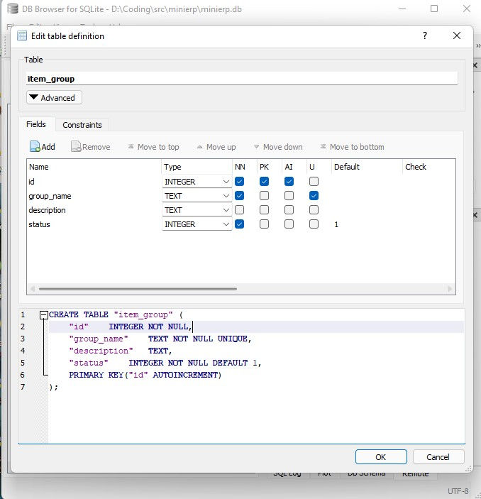
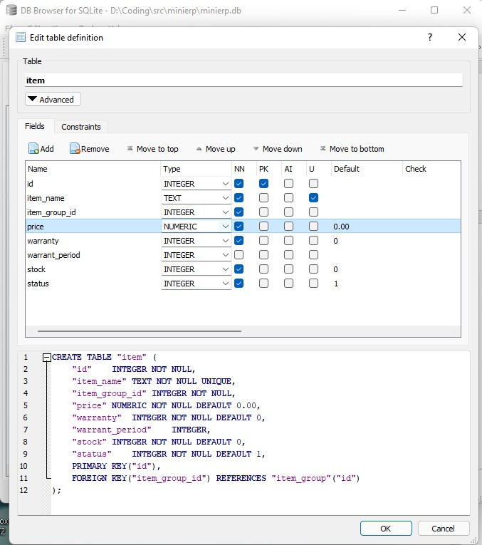
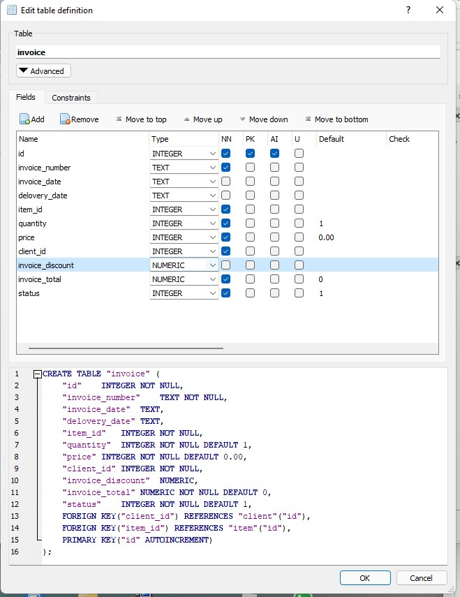
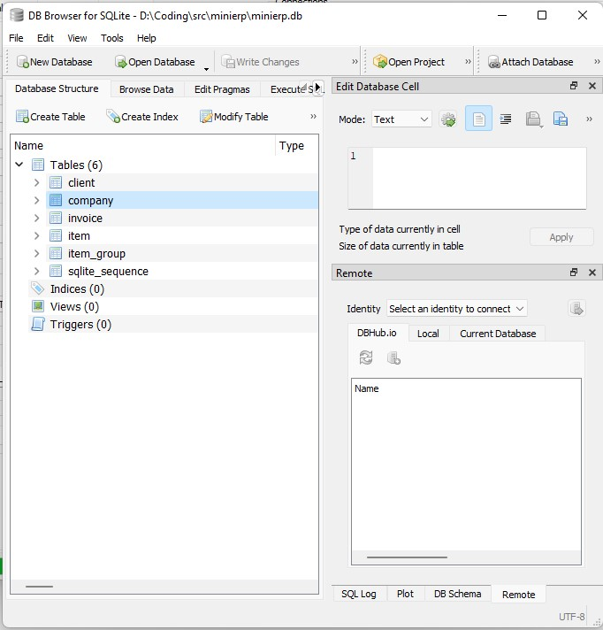

# Database Table Requirment 
==================


## Step 1 - Download SqliteBrowser
[Cck here to download ](https://sqlitebrowser.org/dl/)

## Step 2 -Database Table Structure
 -------------------------------
 
 ## client -> customer, contact,
 - id
 - name
 - mobile
 - email
 - address 
 - status
 


## item_group ( product-> handset, charger,  service / repair )

- id
- group_name
- description
- status


 
 ## item: 
 - id
 - item_name: SAMSUNG-GALAXY13
 - item_group_id -> CHARGER
 - price: 100.50 --> NUMERIC
 - warranty-> yes/no -> 1,0
 - warranty_period: 30 days
 - stock -> integer
 - status -> 1,0
 
 
 
 
 ## invoice (order)
 - id
 - invoice_number
 - invoice_date
 - delivery_date
 - item_id
 - quantity
 - price
 - client_id
 - invoice_discount
 - invoice_total
 - status



## Company

- id
- company name
- address
- website
- email
- mobile
- logo
- status


  
 ```
 CREATE TABLE "client" (
	"id"	INTEGER NOT NULL,
	"name"	TEXT NOT NULL,
	"mobile"	TEXT,
	"email"	TEXT,
	"address"	TEXT,
	"status"	INTEGER NOT NULL DEFAULT 1,
	PRIMARY KEY("id" AUTOINCREMENT)
);

CREATE TABLE "item_group" (
	"id"	INTEGER NOT NULL,
	"group_name"	TEXT NOT NULL UNIQUE,
	"description"	TEXT,
	"status"	INTEGER NOT NULL DEFAULT 1,
	PRIMARY KEY("id" AUTOINCREMENT)
);

CREATE TABLE "item" (
	"id"	INTEGER NOT NULL,
	"item_name"	TEXT NOT NULL UNIQUE,
	"item_group_id"	INTEGER NOT NULL,
	"price"	NUMERIC NOT NULL DEFAULT 0.00,
	"warranty"	INTEGER NOT NULL DEFAULT 0,
	"warranty_period"	INTEGER,
	"stock"	INTEGER NOT NULL DEFAULT 0,
	"status"	INTEGER NOT NULL DEFAULT 1,
	PRIMARY KEY("id"),
	FOREIGN KEY("item_group_id") REFERENCES "item_group"("id")
);

CREATE TABLE "invoice" (
	"id"	INTEGER NOT NULL,
	"invoice_number"	TEXT NOT NULL,
	"invoice_date"	TEXT,
	"delivery_date"	TEXT,
	"item_id"	INTEGER NOT NULL,
	"quantity"	INTEGER NOT NULL DEFAULT 1,
	"price"	NUMERIC NOT NULL DEFAULT 0.00,
	"client_id"	INTEGER NOT NULL,
	"invoice_discount"	NUMERIC,
	"invoice_total"	NUMERIC NOT NULL DEFAULT 0,
	"status"	INTEGER NOT NULL DEFAULT 1,
	PRIMARY KEY("id" AUTOINCREMENT),
	FOREIGN KEY("item_id") REFERENCES "item"("id"),
	FOREIGN KEY("client_id") REFERENCES "client"("id")
);

CREATE TABLE "company" (
	"id"	INTEGER NOT NULL,
	"company_name"	TEXT NOT NULL,
	"address"	TEXT,
	"website"	TEXT,
	"email"	TEXT,
	"mobile"	TEXT,
	"logo"	TEXT,
	"status"	INTEGER NOT NULL DEFAULT 1,
	PRIMARY KEY("id" AUTOINCREMENT)
);
```
### Check all Table -
