# SQLite 
## SQlite is an open source software

#
[This is the official website of SQlite](https://sqlitebrowser.org/ )

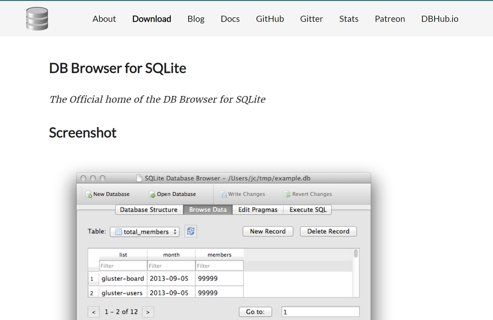

Download the software according to your OS

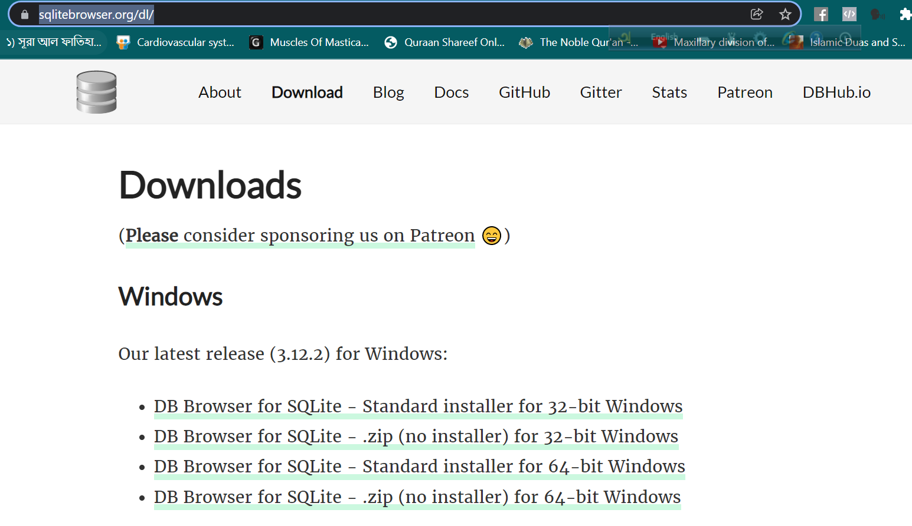

After installation open DB Browser from your desktop


After opening the DB Browse you will see this interface( Like the following image)

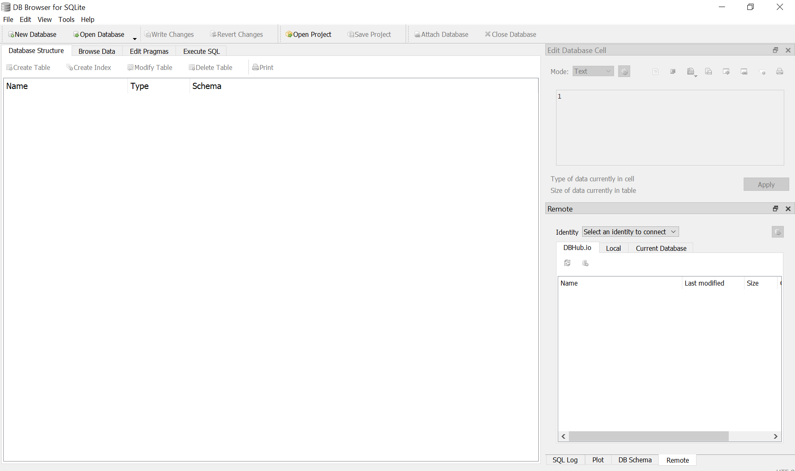

### To create a new database click “New Database” from top left side.

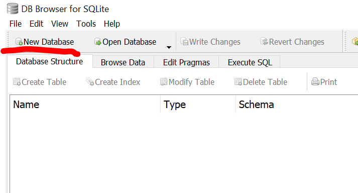

### Then Choose a filename and location where you want to keep this database. 

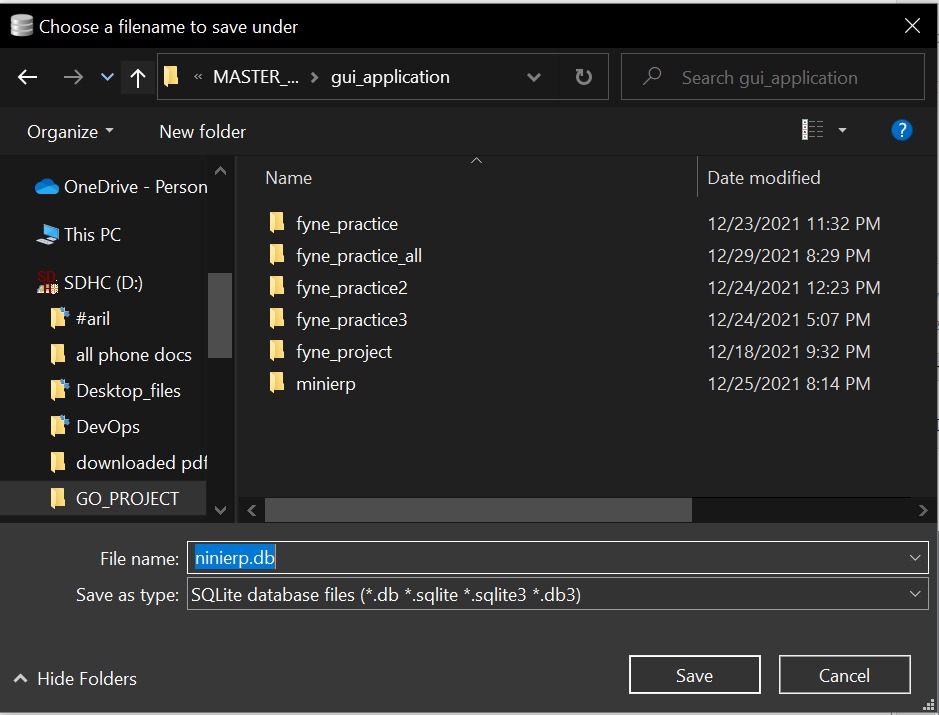

### After you save this you will see a window where you can create  table for your database.

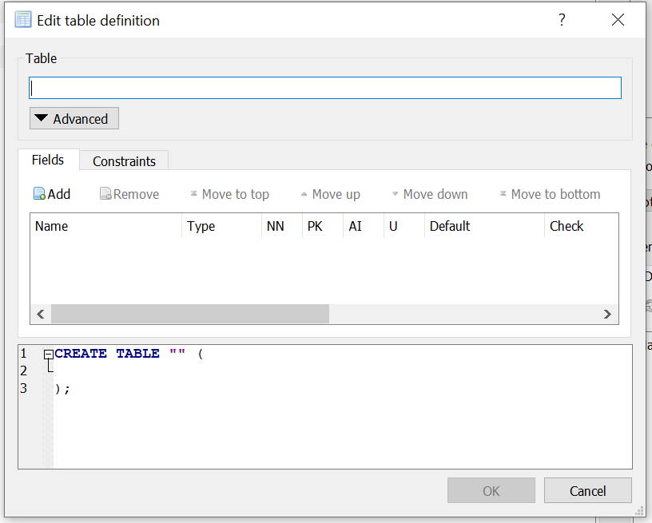

Now we will create our database tables.

We will create 5 tables for this desktop application project:

* Client (Customer, contact details)
* Item group (product or service details)
* Item 
* invoice (order details)
* Company (company details) 

To create table click on “create table” section on top left side.

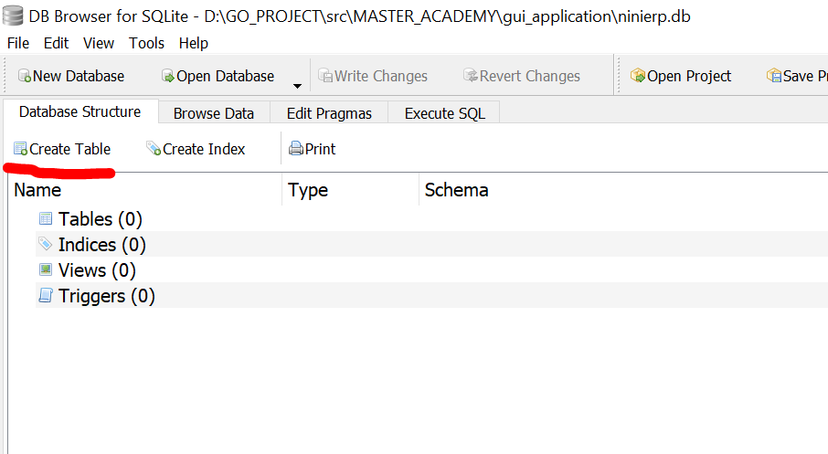


## Table for client:

### Here fields are: 
* id
* name
* mobile
* email
* address
* status

In type section we will select our required type. 

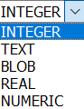

* NN = not null
* PK = primary key
* AI = Auto increment
* U = Unique

[ N.B: When we mark any field as NN (not null) we must give a default value. ]

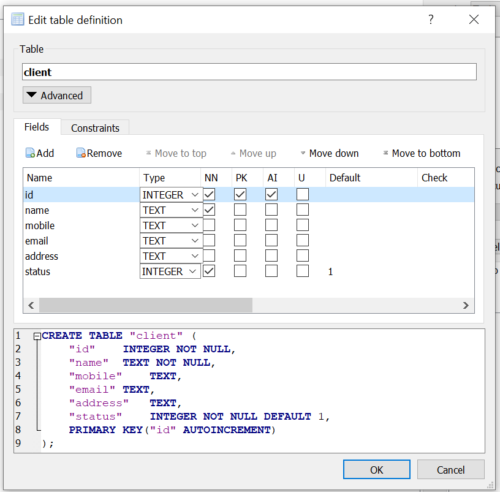


```sql

CREATE TABLE "client" (
	"id"	INTEGER NOT NULL,
	"name"	TEXT NOT NULL,
	"mobile"	TEXT,
	"email"	TEXT,
	"address"	TEXT,
	"status"	INTEGER NOT NULL DEFAULT 1,
	PRIMARY KEY("id" AUTOINCREMENT)
);
```


## Table for item_group
### Fields are: 
* id 
* group_name 
* description
* status

```sql
CREATE TABLE "item_group" (
	"id"	INTEGER NOT NULL,
	"group_name"	TEXT NOT NULL UNIQUE,
	"description"	TEXT,
	"status"	INTEGER NOT NULL DEFAULT 1,
	PRIMARY KEY("id" AUTOINCREMENT)
);
```

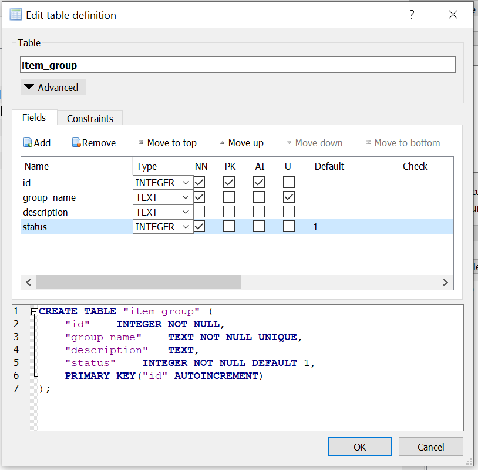


## Table for item:
Fields are: 
* id
* item_name
* item_group_id
* price, warranty
* warranty_period
* stock
* status

[N:B: Here item_group_id is foreign key. It is from another table(item_group)]

```sql
CREATE TABLE "item" (
	"id"	INTEGER NOT NULL,
	"item_name"	TEXT NOT NULL UNIQUE,
	"item_group_id"	INTEGER NOT NULL,
	"price"	NUMERIC NOT NULL DEFAULT 0.00,
	"warranty"	INTEGER NOT NULL DEFAULT 0,
	"warranty_period"	INTEGER,
	"stock"	INTEGER NOT NULL DEFAULT 0,
	"status"	INTEGER NOT NULL DEFAULT 1,
	PRIMARY KEY("id" AUTOINCREMENT),
	FOREIGN KEY("item_group_id") REFERENCES "item_group"("id")
);
```

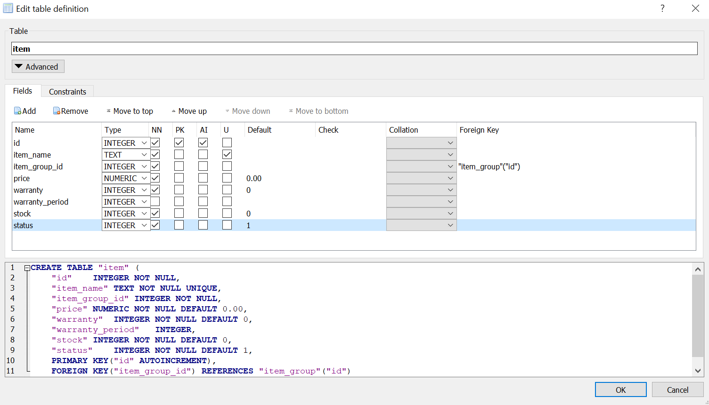

## Table for invoice:

Fields are: 
* id
* invoice_number
* invoice_date
* delivery_date
* item_id
* quantity
* price
* client_id
* invoice_discount
* invoice_total
* status

[Here item_id and client_id are foreign key. These are from another tables (item, client) ]


```sql
CREATE TABLE "invoice" (
	"id"	TEXT NOT NULL,
	"invoice_number"	TEXT NOT NULL,
	"invoice_date"	TEXT,
	"delivary_date"	TEXT,
	"item_id"	INTEGER NOT NULL,
	"quantity"	INTEGER NOT NULL DEFAULT 1,
	"price"	NUMERIC NOT NULL DEFAULT 0.00,
	"client_id"	INTEGER NOT NULL,
	"invoice_discount"	NUMERIC,
	"invoice_total"	NUMERIC NOT NULL DEFAULT 0.00,
	"status"	INTEGER NOT NULL DEFAULT 1,
	PRIMARY KEY("id"),
	FOREIGN KEY("item_id") REFERENCES "item"("id"),
	FOREIGN KEY("client_id") REFERENCES "client"("id")
);
```

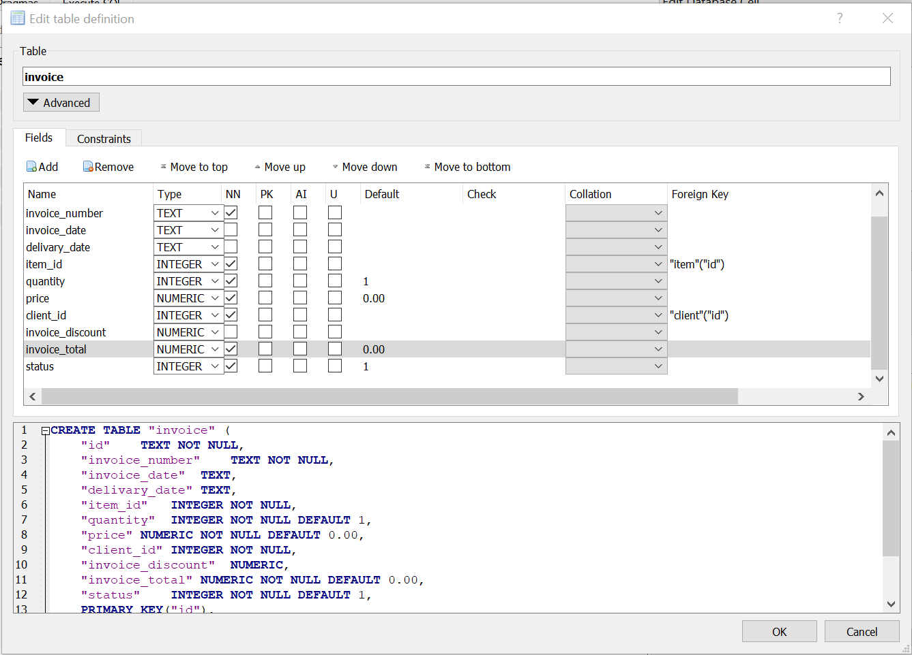

## Table for company:

Fields are: 
* id
* company_name
* address
* website
* email
* mobile
* logo
* status

```sql
CREATE TABLE "company" (
	"id"	INTEGER NOT NULL,
	"company_name"	TEXT NOT NULL,
	"address"	TEXT,
	"website"	TEXT,
	"email"	TEXT,
	"mobile"	TEXT,
	"logo"	TEXT,
	"status"	INTEGER NOT NULL DEFAULT 1,
	PRIMARY KEY("id" AUTOINCREMENT)
);
```

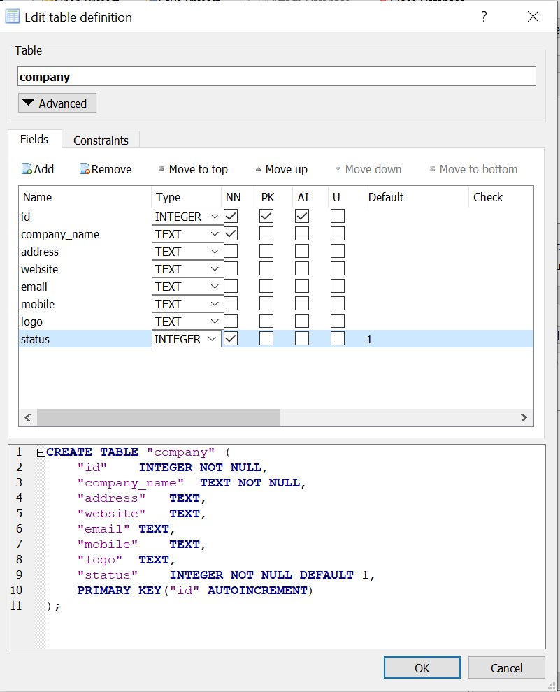

## All tables are created in database 

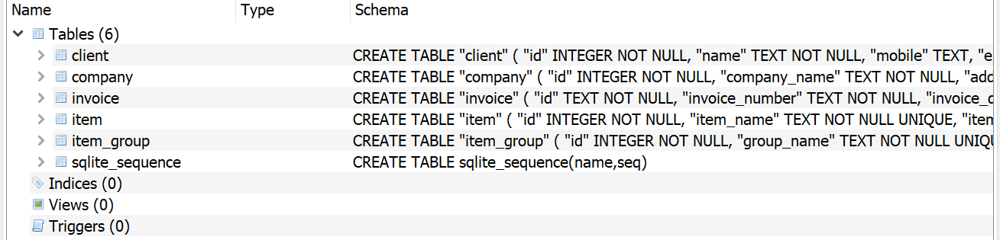


