## Data entry by manual

### Data entry to client table

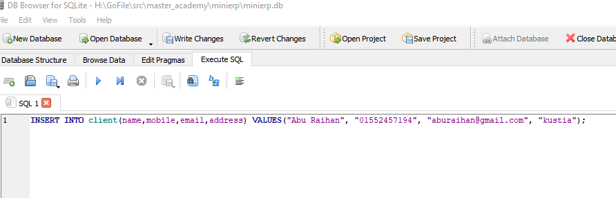
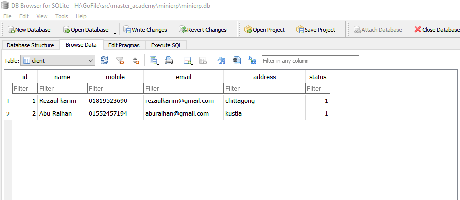

### Data entry to item_group table

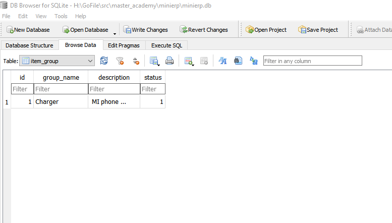

### Data entry to item table

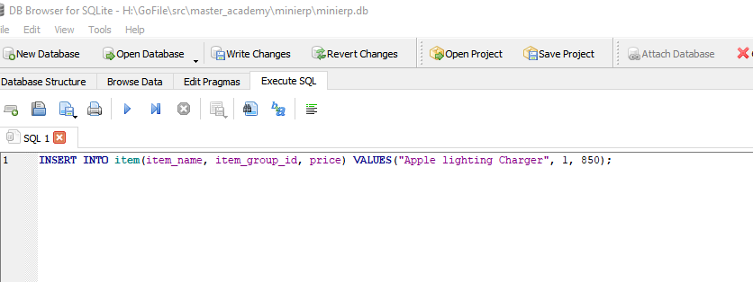
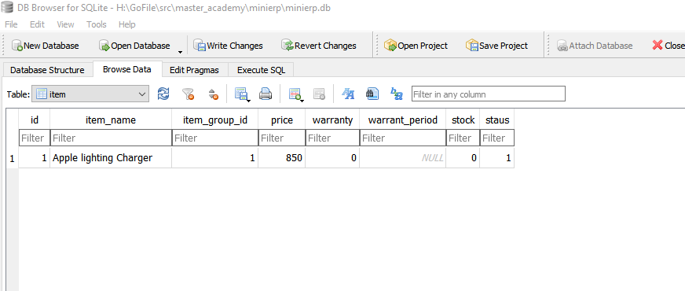

### Data entry to invoice table

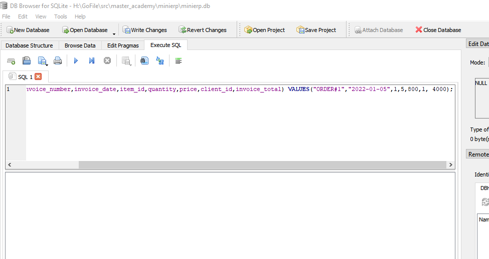
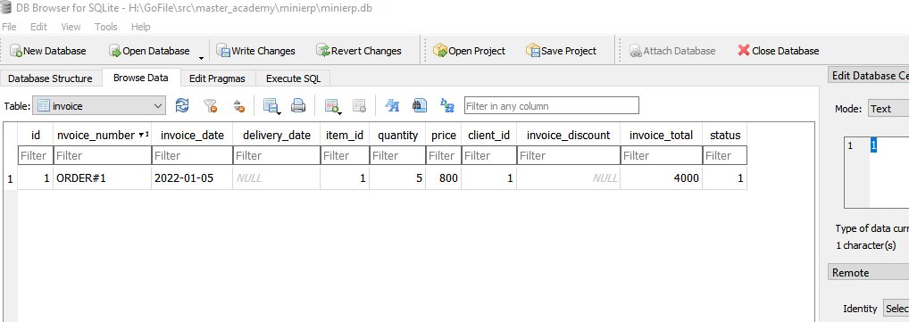

### Query our data from client table and invoice table

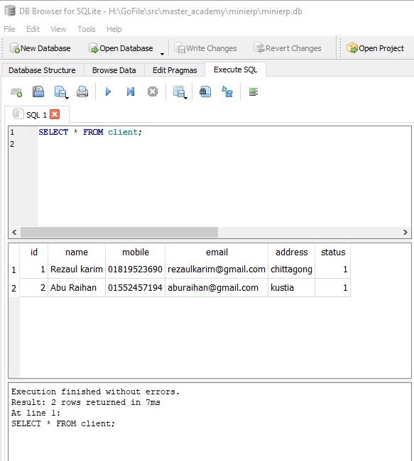
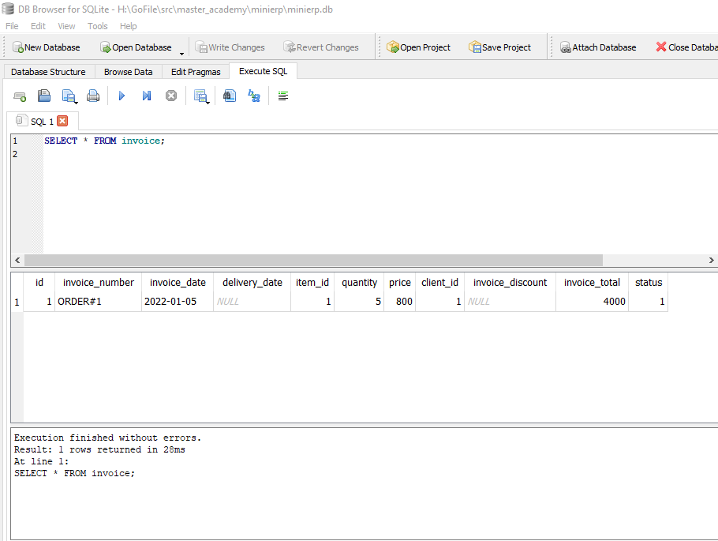

### Get client_id,client_name,item_name from joint table

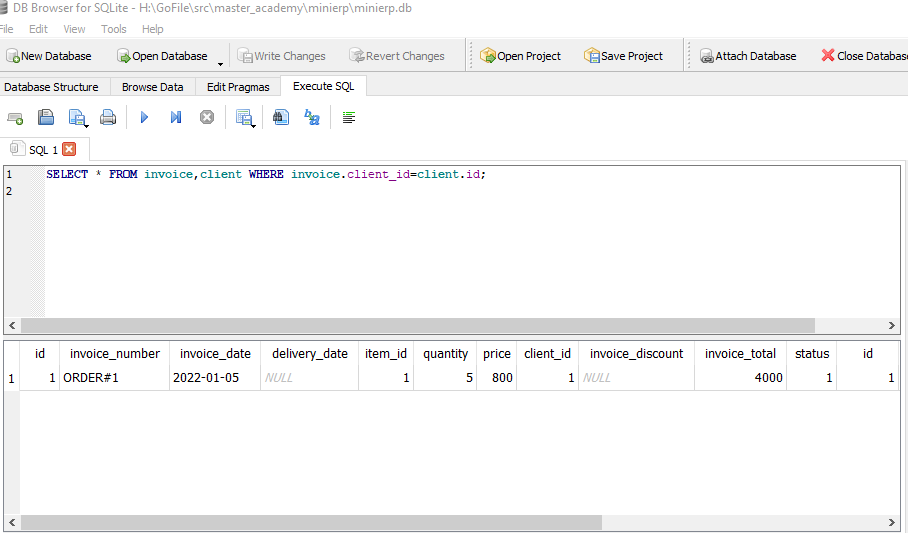
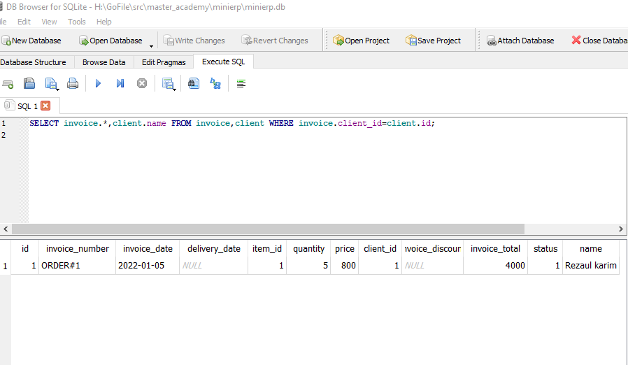
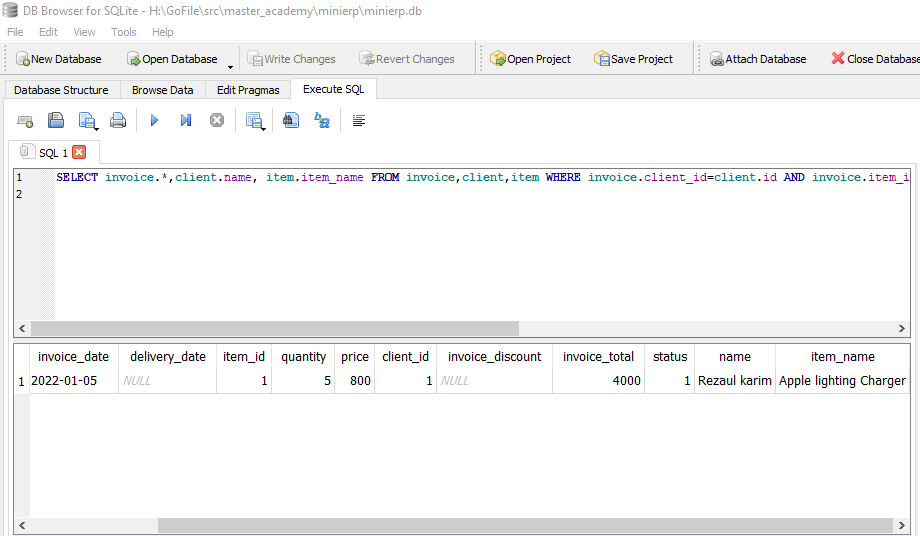

