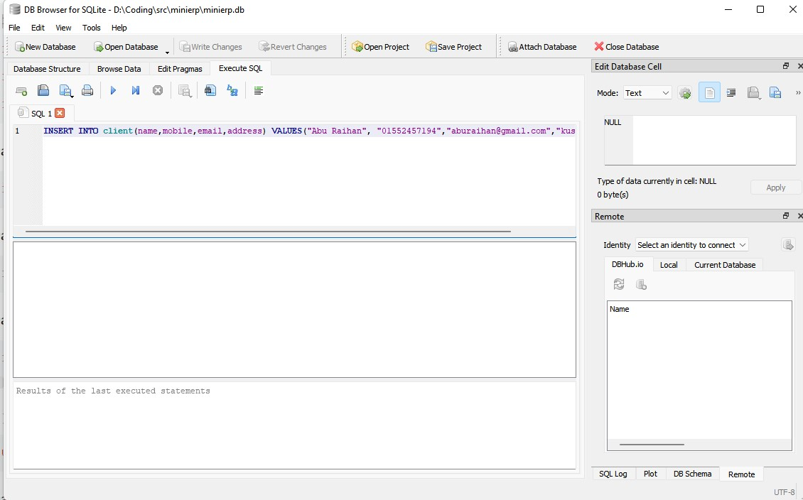
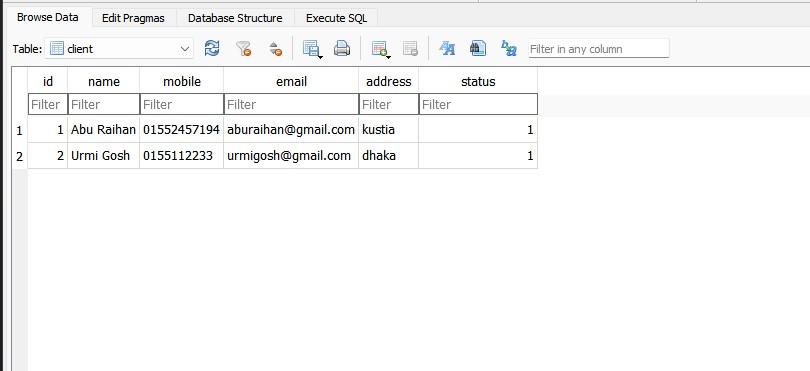
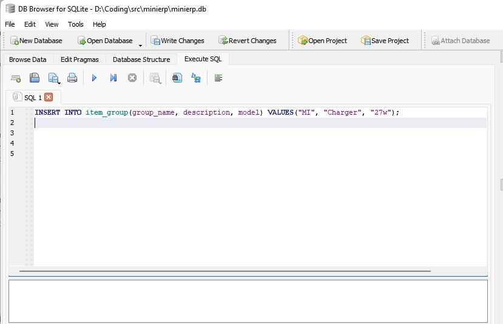
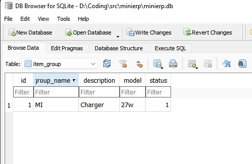
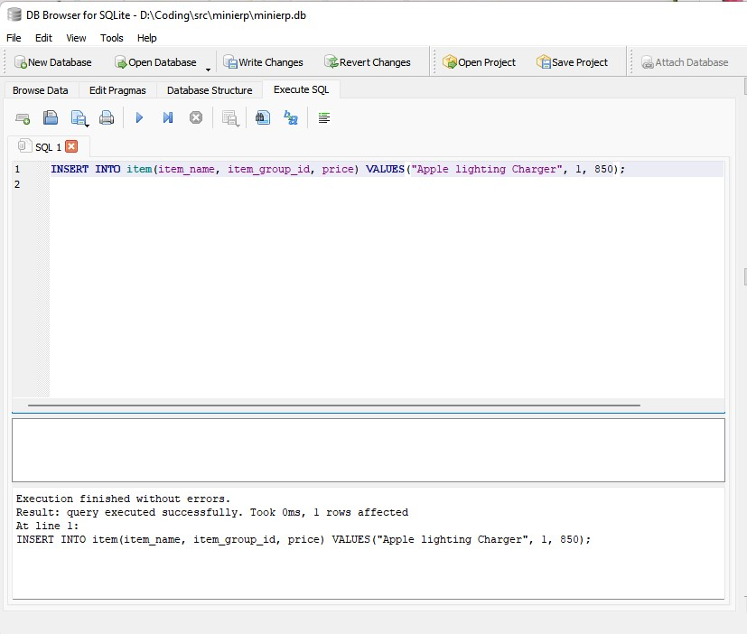
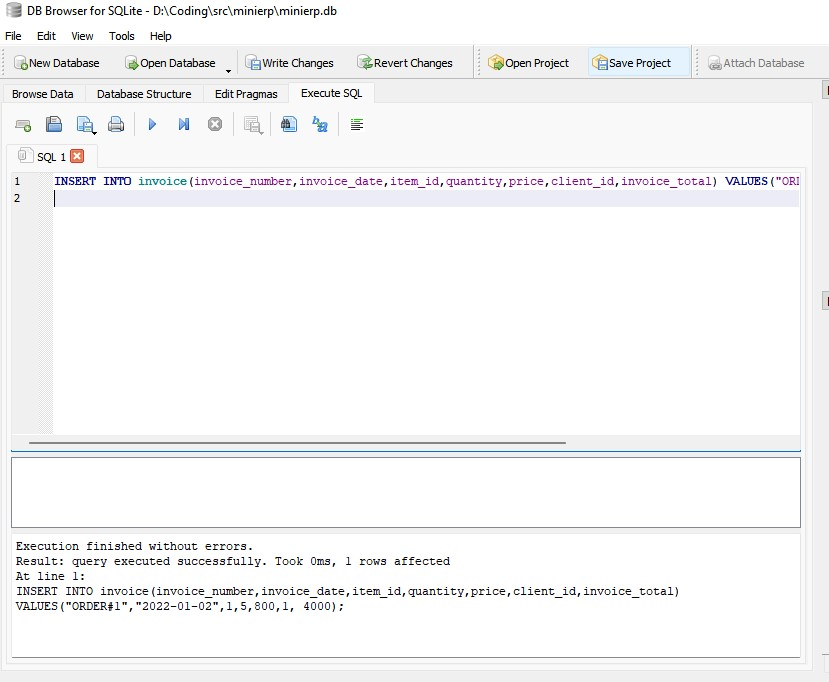
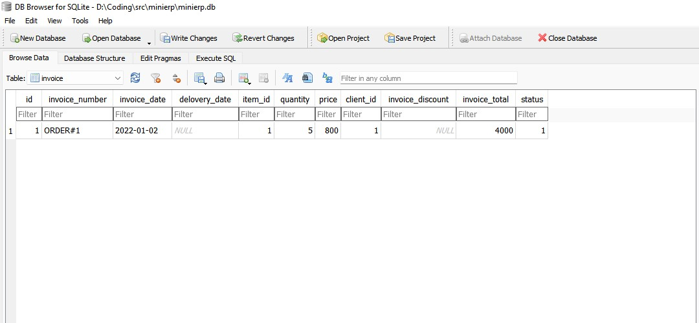
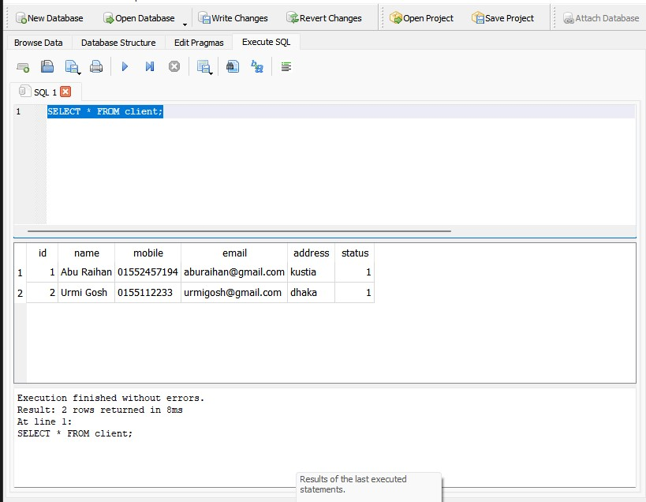

## Manual Data Entry to sqlite

### data insert to client table

```sql
INSERT INTO client(name,mobile,email,address) VALUES("Abu Raihan", "01552457194", "aburaihan@gmail.com", "kustia");
```





### data insert to item_group table

```sql
INSERT INTO item_group(group_name, description, model) VALUES("MI", "Charger", "27w");
```





### data insert to item table

```sql
INSERT INTO item(item_name, item_group_id, price) VALUES("Apple lighting Charger", 1, 850);
```




### data insert to invoice table

```sql
INSERT INTO invoice(invoice_number,invoice_date,item_id,quantity,price,client_id,invoice_total) VALUES("ORDER#1","2022-01-02",1,5,800,1, 4000);
```





## Now we query our data how fetch from table

- let's a client table data check

```sql
SELECT * FROM client;

```



> just call by table

```sql
SELECT * FROM tableName;
```
