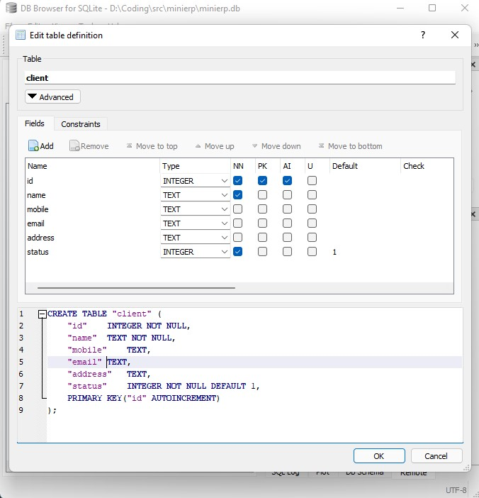
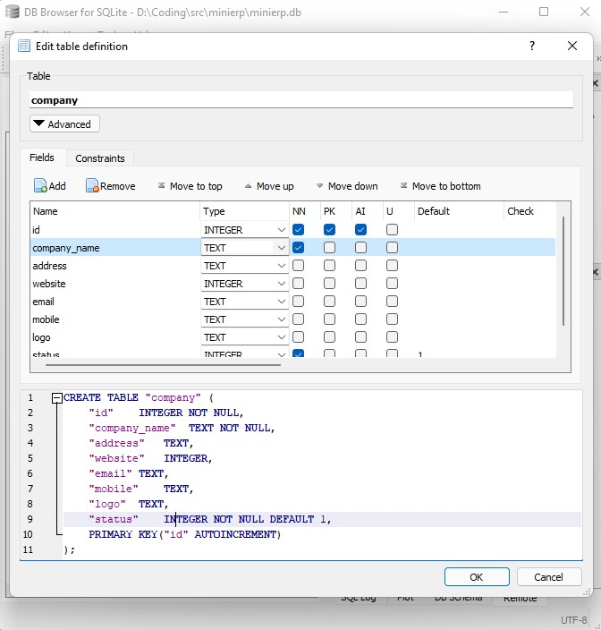

## Fyne installation on Windows 
* step 1 [`Install Go`](https://youtu.be/hffMABwkW00)
* step 2 `Install Gcc`
> Install `MSYS2` from [msys2.org](https://www.msys2.org/) 


* step 3 - after install `msys2` Open “MSYS2 MinGW 64-bit” from start menu..
* Step 4 - use this command on `MinGW Terminal`
```bash
pacman -Syu
```

> press `y` to install


### step 5 - Another command use on MinGW Terminal
```bash
pacman -Su
```

### step 6 - next command use this ...
```bash
pacman -S --needed base-devel mingw-w64-x85_64-toolchain
```

### `importent` :=  Add `C:\msys64\mingw64\bin` to `PATH` in `User Variables` and in `System Variables`


### * now your `GCC` ready for play with `FYNE`.
* Step 7 - For Fyne Download
```bash
go get fyne.io/fyne/v2
```
* Step 8 - To finish your module’s set up, you now need to tidy the module file to correctly reference Fyne as a dependency. You do this by using the following command (can be skipped if you are not using modules): 


```bash
go mod tidy
```

### Run the demo
If you want to see the Fyne toolkit in action before you start to code your own application, you can see our demo app running on your computer by executing:

```bash
go run fyne.io/fyne/v2/cmd/fyne_demo
```
=====================================================================================
# Database Table Requirment 
==================


## Step 1 - Download SqliteBrowser
[Cck here to download ](https://sqlitebrowser.org/dl/)

## Step 2 -Database Table Structure
 -------------------------------
 
 ## client -> customer, contact,
 - id
 - name
 - mobile
 - email
 - address 
 - status
 


## item_group ( product-> handset, charger,  service / repair )

- id
- group_name
- description
- status


 
 ## item: 
 - id
 - item_name: SAMSUNG-GALAXY13
 - item_group_id -> CHARGER
 - price: 100.50 --> NUMERIC
 - warranty-> yes/no -> 1,0
 - warranty_period: 30 days
 - stock -> integer
 - status -> 1,0
 
 
 
 
 ## invoice (order)
 - id
 - invoice_number
 - invoice_date
 - delivery_date
 - item_id
 - quantity
 - price
 - client_id
 - invoice_discount
 - invoice_total
 - status


## Company

- id
- company name
- address
- website
- email
- mobile
- logo
- status


  
 ```
 CREATE TABLE "client" (
	"id"	INTEGER NOT NULL,
	"name"	TEXT NOT NULL,
	"mobile"	TEXT,
	"email"	TEXT,
	"address"	TEXT,
	"status"	INTEGER NOT NULL DEFAULT 1,
	PRIMARY KEY("id" AUTOINCREMENT)
);

CREATE TABLE "item_group" (
	"id"	INTEGER NOT NULL,
	"group_name"	TEXT NOT NULL UNIQUE,
	"description"	TEXT,
	"status"	INTEGER NOT NULL DEFAULT 1,
	PRIMARY KEY("id" AUTOINCREMENT)
);

CREATE TABLE "item" (
	"id"	INTEGER NOT NULL,
	"item_name"	TEXT NOT NULL UNIQUE,
	"item_group_id"	INTEGER NOT NULL,
	"price"	NUMERIC NOT NULL DEFAULT 0.00,
	"warranty"	INTEGER NOT NULL DEFAULT 0,
	"warranty_period"	INTEGER,
	"stock"	INTEGER NOT NULL DEFAULT 0,
	"status"	INTEGER NOT NULL DEFAULT 1,
	PRIMARY KEY("id"),
	FOREIGN KEY("item_group_id") REFERENCES "item_group"("id")
);

CREATE TABLE "invoice" (
	"id"	INTEGER NOT NULL,
	"invoice_number"	TEXT NOT NULL,
	"invoice_date"	TEXT,
	"delivery_date"	TEXT,
	"item_id"	INTEGER NOT NULL,
	"quantity"	INTEGER NOT NULL DEFAULT 1,
	"price"	NUMERIC NOT NULL DEFAULT 0.00,
	"client_id"	INTEGER NOT NULL,
	"invoice_discount"	NUMERIC,
	"invoice_total"	NUMERIC NOT NULL DEFAULT 0,
	"status"	INTEGER NOT NULL DEFAULT 1,
	PRIMARY KEY("id" AUTOINCREMENT),
	FOREIGN KEY("item_id") REFERENCES "item"("id"),
	FOREIGN KEY("client_id") REFERENCES "client"("id")
);

CREATE TABLE "company" (
	"id"	INTEGER NOT NULL,
	"company_name"	TEXT NOT NULL,
	"address"	TEXT,
	"website"	INTEGER,
	"email"	TEXT,
	"mobile"	TEXT,
	"logo"	TEXT,
	"status"	INTEGER NOT NULL DEFAULT 1,
	PRIMARY KEY("id" AUTOINCREMENT)
);
```
### Check all Table -


